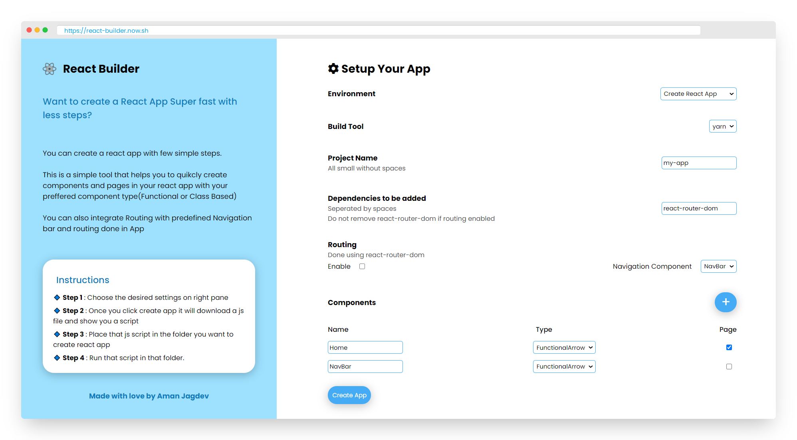
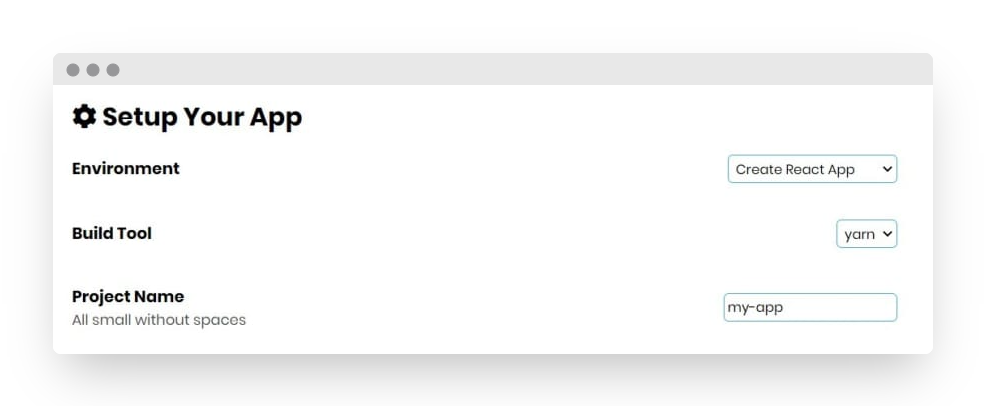
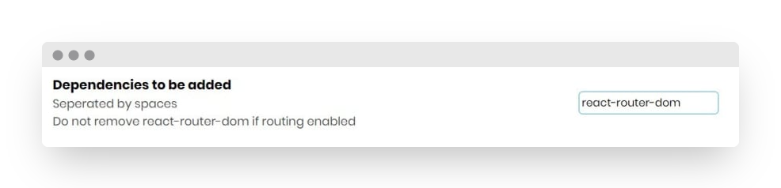
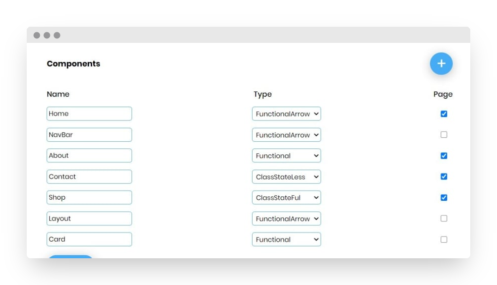
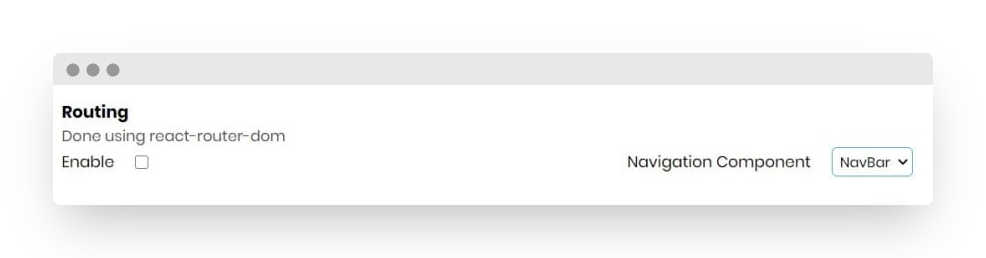
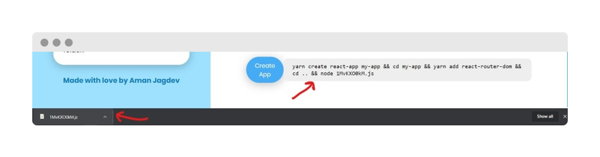
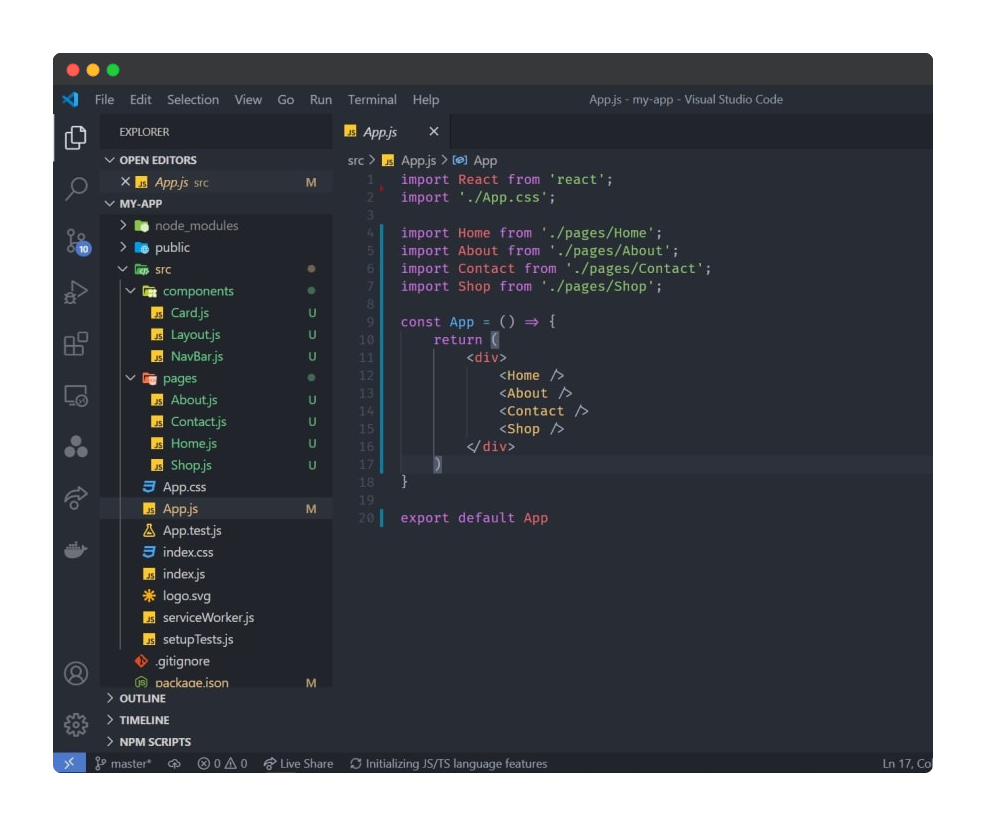

[](https://github.com/amanjagdev/react-builder/graphs/contributors/)
[](https://github.com/amanjagdev/react-builder/stargazers/)
[](https://github.com/amanjagdev/react-builder/network/members/)
[](http://makeapullrequest.com)
[](http://perso.crans.org/besson/LICENSE.html)
<!-- [](https://github.com/amanjagdev/react-builder/badges/) -->

<!-- PROJECT LOGO -->
<br />
<p align="center">
  <a href="https://github.com/amanjagdev/react-builder">
    
  </a>

   <h1 align="center">React Builder </h1>
    <div align="center">
  <h4 >
    Build your react apps faster 
  </h4>
  <p>Make your react app with components and pages customised to your needs with routing and naviagtion with desired dependencies already done for you. Everything within a click's reach.</p>
    .
    <a href="https://github.com/amanjagdev/react-builder/issues">Report Bug</a>
    ·
    <a href="https://github.com/amanjagdev/react-builder/issues">Request Feature</a>
    </div>
</p>

<!-- TABLE OF CONTENTS -->

## Table of Contents

- [Table of Contents](#table-of-contents)
- [About The Project](#about-the-project)
  - [What it does for you?](#what-it-does-for-you)
  - [Built With](#built-with)
- [Getting Started](#getting-started)
  - [Prerequisites](#prerequisites)
  - [Installation](#installation)
- [Usage](#usage)
      - [Step 1 |  Choose your preferences](#step-1--choose-your-preferences)
      - [Step 2 | Choose Dependencies to add](#step-2--choose-dependencies-to-add)
      - [Step 3 | Add Components and Pages](#step-3--add-components-and-pages)
      - [Step 4 | Add routing](#step-4--add-routing)
      - [Step 5 | Build your App](#step-5--build-your-app)
      - [Final Result](#final-result)
- [Roadmap](#roadmap)
- [Contributing](#contributing)
- [Contact](#contact)

<!-- ABOUT THE PROJECT -->

## About The Project

<!-- [![Product Name Screen Shot][product-screenshot]](https://example.com) -->

<p align ="center">



An application to help you build your react apps faster. Make your react app with components and pages customised to your needs with routing and naviagtion with desired dependencies already done for you.Everything within a click's reach.

### What it does for you?

- Create Functional or Class based compoenents with state integrated or optional according to you.
- Create Functional or Class based pages with state integrated or optional according to you.
- Does routing for you and make the corresponding navigation component for it
- Add dependencies to your project
- All above things with a single click and you are ready to go

### Built With

<p float ="right">


</p>
<!-- GETTING STARTED -->

## Getting Started

To get a local copy up and for running the project locally, follow these simple steps.

### Prerequisites

Have Node along with a package manager installed in the system

### Installation

1. Clone the repo and enter it

```sh
git clone https://github.com/amanjagdev/react-builder.git
cd react-builder 
```

3. Install packages

```sh
yarn | npm install
```

4. Run the development server

```sh
yarn start | npm start
```

<!-- USAGE EXAMPLES -->

## Usage

##### Step 1 |  Choose your preferences

Here you can select your preferred starter environment currently it only supports `create-react-app`.
Moreover, you can choose between yarn or npm/npx. And you can give the name to your project.

<p align ="center">



##### Step 2 | Choose Dependencies to add

You can directly mention packages you want to add in the app.
Ex: We have `react-router-dom axios` etc..

<p align ="center">



##### Step 3 | Add Components and Pages

Here you can add all the component Names with their type and you can select whether a component is a page or not.

_Note: Routing will only be done between components marked as pages_

<p align ="center">



##### Step 4 | Add routing

You can enable routing in your app from here. And you can select which component to use as Navigation Component or you can say Navigation Bar.

NOTE : _Don't remove `react-router-dom` dependency if you enable routing_

<p align ="center">



##### Step 5 | Build your App

Once you click on **Create App** It will download a js file and will give you a script

You would need to place that js file in the folder you want to create the react app and run the script there.

<p align ="center">



##### Final Result

You have successfully created your react app with desired preferences.

The folder structure generated with App.js on following the above steps looks like this.

<p align ="center">



<!-- ROADMAP -->

## Roadmap

See the [open issues](https://github.com/amanjagdev/react-builder/issues) for a list of proposed features (and known issues).

<!-- CONTRIBUTING -->

## Contributing

Contributions are what make the open source community such an amazing place to be learn, inspire, and create. Any contributions you make are **greatly appreciated**.

1. Fork the Project
2. Create your Feature Branch (`git checkout -b feature/AmazingFeature`)
3. Commit your Changes (`git commit -m 'Add some AmazingFeature'`)
4. Push to the Branch (`git push origin feature/AmazingFeature`)
5. Open a Pull Request

<!-- CONTACT -->

## Contact

<!-- <Names> -->

Aman Jagdev - [GitHub](https://github.com/amanjagdev) - amankumarjagdev@gmail.com

<p align = "center" >Made with :heart: for :earth_asia: Everyone </p>
